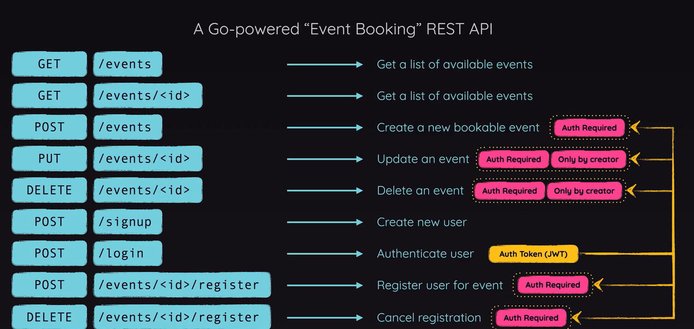

# GO LANG API
This project serves as a practice to use GO to create an API that can be used to interact with database and has authorization feature using JSON Web Token.


## Setup an API using GIN
1. Initialize
* This is a helpful guide to get started: https://gin-gonic.com/en/docs/routing/http-method/

2. How to obtain the body request
* Guide: https://gin-gonic.com/en/docs/binding/binding-and-validation/
* Example:
``` go
type Event struct {
	Id          int64
	Name        string `binding:"required"` // when trying to bind this struct, this information must be provided
	Location    string `binding:"required"`
	Description string `binding:"required"`
	UserId      int64
}

func addEvent(context *gin.Context) {
    // Get the body request and bind it to the event struct
    newEvent := models.Event{}
    err := context.ShouldBindJSON(&newEvent)
    if err != nil {
        context.JSON(http.StatusBadRequest, gin.H{"message": err.Error()})
        return

    // do something...
}
```

3. Full list of HTTP Error
* Link: https://pkg.go.dev/net/http#pkg-constants


## Database using SQL
1. Packages required:
* SQL package: https://pkg.go.dev/database/sql#section-documentation
* Sqlite3 driver: https://pkg.go.dev/github.com/mattn/go-sqlite3
* GCC (to allow using CGO package): https://jgrivera.hashnode.dev/installing-gcc-on-windows-for-go
    * What is CGO? - a "pseudo-package" that enables Go packages to call C code

2. Starter Guide:
* Link: https://go.dev/wiki/SQLInterface

3. Database File - creating programmatically
* Your database should not be tracked by Git.
* Therefore, it should be created automatically programmatically after deployed (if it not already exists.)
* To create a file programmatically (only if it not already exists):
``` go
func InitializeDatabase() {

	// Create database sql file
	filename := "api.sql"
	file, err := os.OpenFile(filename, os.O_CREATE|os.O_EXCL|os.O_WRONLY, 0644)
	if err != nil {
		if os.IsExist(err) {
			// file already exists, skip
		} else {
			panic("Fail to create the database file.")
		}
	}
	defer file.Close()

    // Connect to the database
	Db, err = sql.Open("sqlite3", filename)
	if err != nil {
		panic(err.Error())
	}

    // Create table...
}
```

4. General keypoint in using sql
* Guide: https://pkg.go.dev/database/sql#DB
* When the action expects returned multiple row of results: `func (db) Query(query, args)`
* When the action expects returned 1 row of results: `func (db) QueryRow (query, args)`
* When the action doesnt expect any row of results returned: `func (db) Prepare (query)` & `func (s) Exec(args)`
* Always remember to close the connection using `.Close()`

5. To read multiple rows returned from a sql query
``` go
func FetchAllEvent() ([]models.Event, error) {

	// Placeholder
	fetchedEvents := []models.Event{}

	// Execute query statement
	query := `
	SELECT * FROM events
	`
	rows, err := Db.Query(query)
	if err != nil {
		return []models.Event{}, err
	}
	defer rows.Close()

	// Save the return results into placeholder
	for rows.Next() {
		var name, location, description string
		var id, userId int64
		err := rows.Scan(&id, &name, &location, &description, &userId)
		if err != nil {
			return []models.Event{}, err
		}
		fetchedEvents = append(fetchedEvents, models.Event{
			Id:          id,
			Name:        name,
			Location:    location,
			Description: description,
			UserId:      userId,
		})
	}

	// Return results when no error
	return fetchedEvents, nil

}
```

6. To check number of row affected - `result.RowsAffected()`
```go
func UpdateEventById(updatedEvent models.Event) error {

	// Prepare query statement
	query := `
	UPDATE events
	SET name = $1, location = $2, description = $3
	WHERE id = $4 AND user_id = $5
	`
	stmt, err := Db.Prepare(query)
	if err != nil {
		return err
	}
	defer stmt.Close()

	// Execute query statement
	result, err := Db.Exec(query, updatedEvent.Name, updatedEvent.Location, updatedEvent.Description, updatedEvent.Id, updatedEvent.UserId)
	if err != nil {
		return err
	}

	row_affected, err := result.RowsAffected()
	if err != nil {
		return err
	}

	if row_affected == 0 {
		return errors.New("No update is made.")
	}

	return nil

}
```

## How to create environment variables in GO
1. Package required: https://pkg.go.dev/github.com/joho/Godotenv
``` go
// .env
JWT_SECRET=sfkafabfafbafbabfakf

err := godotenv.Load()
if err != nil {
    panic(err.Error())
}

jwtSecret := os.Getenv("JWT_SECRET")
```


## Authentication using JWT token
1. Create an API endpoint for user to sign up.
* Requires creating a database to store user information and their hashed password.
* The password can be hashed using `bcrypt`: https://pkg.go.dev/golang.org/x/crypto/bcrypt

2. Create an API endpoint for user to log in.
* The endgoal of this endpoint is to verify user's identity
* Once the identity is verified, a signed JWT token will be sent back to the user for them to store in the local storage.
* When they need to access certain API endpoint in the future, this JWT token / string must be attached in the header `Authorization` in the format of `Bearer <JWT string>`.

3. How to create a signed JWT token
* Package: https://pkg.go.dev/github.com/golang-jwt/jwt/v5
* Guide: https://golang-jwt.github.io/jwt/usage/create/
* Example:
``` go
jwtSecret := os.Getenv("JWT_SECRET")
jwtToken := jwt.NewWithClaims(jwt.SigningMethodHS256,
    jwt.MapClaims{
        "id":    userId,
        "email": loginUser.Email,
    })
jwtString, err := jwtToken.SignedString([]byte(jwtSecret))
if err != nil {
    context.JSON(http.StatusInternalServerError, gin.H{"message": err.Error()})
    return
}
```
* Note:
    * Do not store password or sensitive information in the jwt token, because it still can be decoded by anyone
    * However, only those who has the secret key can confirm the source of the signing of this jwt token (which is important for the backend to confirm the identity)
    * It is demonstrated here: https://www.jwt.io/ - Where without the secret, we can still see the content

4. Middlewares to check authentication
* Guide: https://gin-gonic.com/en/docs/middleware/
* Example: Group routes that require authentication routes
``` go
func HandleRoutes(router *gin.Engine) {

	router.GET("/events", getEvents)
	router.GET("/events/:id", getEventById)

	authGroup := router.Group("/")
	authGroup.Use(middlewares.VerifyAuthorization())
	{
		authGroup.POST("/events", addEvent)
		authGroup.PUT("/events/:id", updateEventById)
		authGroup.DELETE("/events/:id", deleteEventById)
		authGroup.POST("/events/:id/register", registerEvent)
		authGroup.DELETE("/events/:id/register", deregisterEvent)
	}

	router.POST("/signup", handleSignup)
	router.POST("/login", handleLogin)
}
```

5. Actual content of the middleware
* Extract the jwt string from the authorization header
* Parse into the jwt token and extract the coded claims
* Set it to the context so the subsequent route can use it
* Example:
``` go
func VerifyAuthorization() gin.HandlerFunc {

	return func(context *gin.Context) {

		// Get jwt string from the header
		rawJwtString := context.GetHeader("Authorization")
		if rawJwtString == "" {
			context.AbortWithStatusJSON(http.StatusUnauthorized, gin.H{"message": "Unauthorized Access."})
			return
		}

		// Strip Bearer from the jwt string
		jwtString := strings.TrimPrefix(rawJwtString, "Bearer ")

		// Parse jwt string into jwt token
		jwtToken, err := jwt.Parse(
			jwtString,
			func(token *jwt.Token) (any, error) {
				return []byte(os.Getenv("JWT_SECRET")), nil
			},
			jwt.WithValidMethods([]string{jwt.SigningMethodHS256.Alg()}),
		)
		if err != nil {
			context.AbortWithStatusJSON(http.StatusUnauthorized, gin.H{"message": err.Error()})
			return
		}

		// Get the token content
		claims, ok := jwtToken.Claims.(jwt.MapClaims)
		if !ok {
			context.AbortWithStatusJSON(http.StatusUnauthorized, gin.H{"message": "Unauthorized Access."})
			return
		}

		// Set context to be used by subsequent routes
		context.Set("userId", claims["id"])
		context.Set("userEmail", claims["email"])

		// Continue to the next handler
		context.Next()
	}

}
```
* Note:
    * The datatype of the claims content will be `any`
    * One will have to do type checking such as `checkSafeVar, ok := var.(float64)` to make it type safe
    * When a number is encoded into claims, it will automatically becomes float64

* To get the content from the `context`
```go
// jwt token stores number as flt64, text as string
userId, exists := context.Get("userId")
if !exists {
    context.JSON(http.StatusUnauthorized, gin.H{"message": "Invalid credentials"})
    return
}
```

## Additional implementation for authentication that could have been done
* Include the time when the JWT token is issued
* In the middleware, always check if it has been longer than a certain time and if so requires the user to login again.